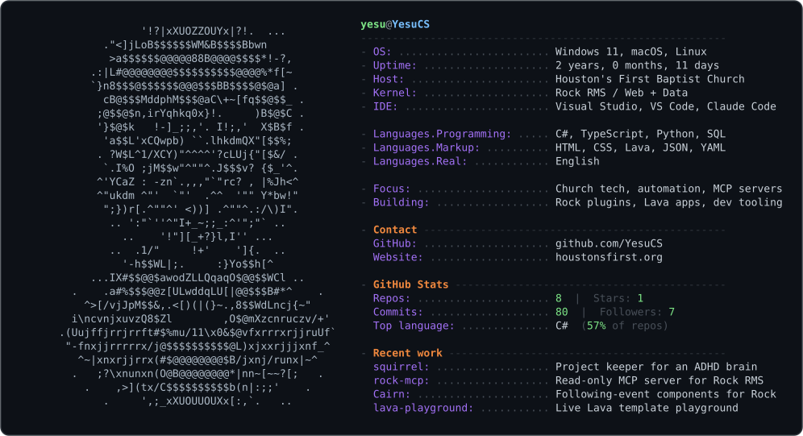

<picture>
  <source media="(prefers-color-scheme: dark)"  srcset="dark_mode.svg">
  <source media="(prefers-color-scheme: light)" srcset="light_mode.svg">
  
</picture>

<!--
  This is a GitHub profile README: it renders on github.com/YesuCS because the
  repository name matches the username.

  The card above is a generated SVG, not a code block - that is what makes the
  colours, the alignment and the light/dark switch work.

    profile.json   the labels and values. Edit this, not the SVGs.
    art.txt        the ASCII portrait
    avatar.png     source image for art.txt
    generate.py    profile.json + art.txt -> dark_mode.svg, light_mode.svg
    asciify.py     avatar.png -> art.txt  (needs pillow; only when the photo changes)

  To change a line of text:
    1. edit profile.json
    2. python3 generate.py
    3. commit dark_mode.svg and light_mode.svg

  The numbers under "GitHub Stats" refresh themselves every Monday via
  .github/workflows/refresh.yml, so they do not need hand-editing.
-->
